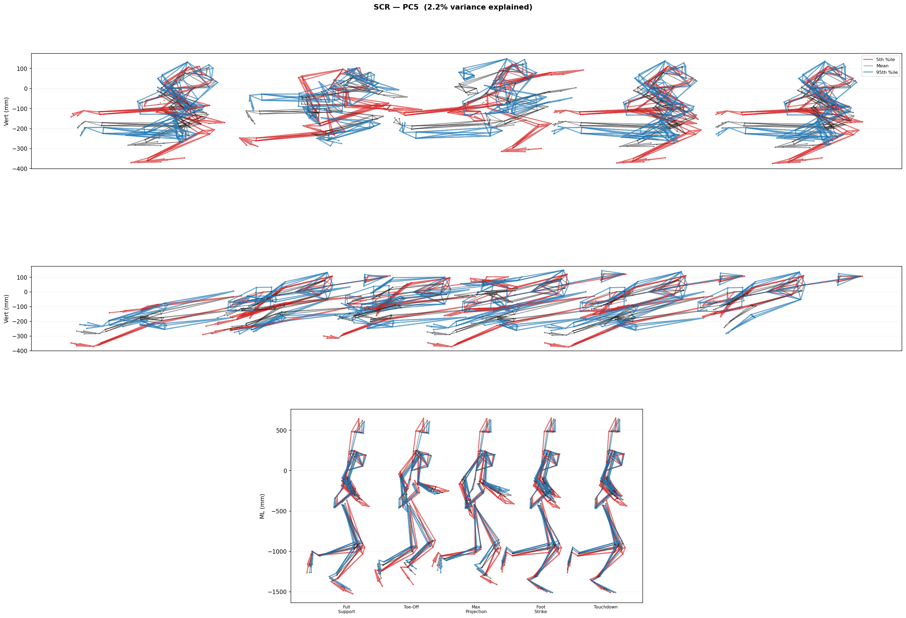
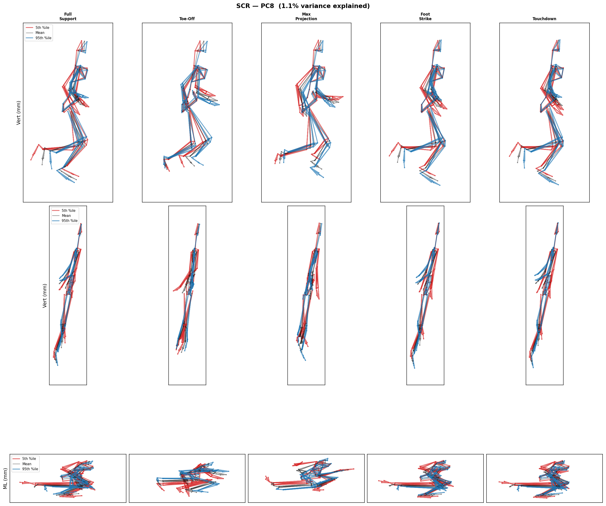
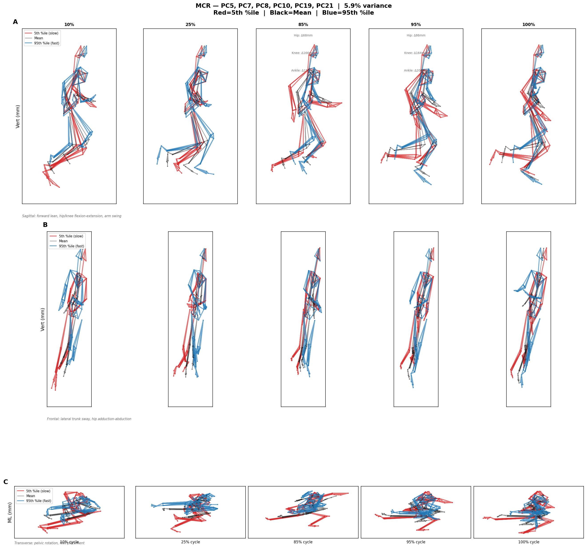

# ML in Sprinting: Predicting Sprint Speed from Whole-Body Kinematics

> *Widely regarded as the most desired physical quality in ball-sports, speed is the trait that separates elite performers from good ones — that creates plays others cannot make.*

---

## Overview

This project applies **functional Principal Component Analysis (fPCA)** and a full suite of machine learning models to whole-body kinematic data from competitive sprinters, with the goal of predicting sprint velocity and identifying movement patterns that differentiate fast from slow athletes.

Key finding: **traditional biomechanical summary statistics (n=18) outperform full fPCA (n=29 PCs) on every matched algorithm** when evaluated via LOO-CV on n=31 subjects — but fPCA provides mechanistic insight that scalars cannot.

---

## The Problem

Contemporary player-tracking systems reduce speed to single-value summaries — peak velocity, average acceleration — collapsing the temporal structure of movement into a number. This obscures a more fundamental question: **what actually constitutes speed in competitive settings?**

Shohei Ohtani's base-stealing illustrates this precisely. In 2025, his Statcast sprint speed ranked ~72nd percentile in MLB (~28.0 ft/sec), yet his stolen base efficiency exceeded 93% in 2024. His advantage lies not in raw speed, but in **how rapidly and consistently he expresses usable speed within constrained windows of time**.

Existing research examines acceleration or maximum velocity in isolation using linear models to relate discrete joint kinematics to speed. This treats sprint phases as independent phenomena rather than continuous transitions, and assumes linear relationships — even though stride frequency exhibits a logarithmic correlation by the third step (Weyand et al., 2000, 2010). No prior study has modeled sprint velocity continuously across all phases while testing for nonlinear kinematic interactions.

---

## Study Design

**31 OUA/USports-level sprinters** (16M / 15F) completed maximal-effort 60-metre sprints from blocks, instrumented with a **64-marker inertial measurement system** capturing whole-body three-dimensional kinematics at 60 Hz.

| Dimension | Detail |
|-----------|--------|
| Participants | 31 (16 Male, 15 Female) |
| Competition level | OUA / USports |
| Sprint distance | 60 metres (block start) |
| Capture rate | 60 Hz |
| Markers | 64 anatomical landmarks |
| Raw feature space | 19,392 per participant (64 markers × 3 axes × 101 frames) |

---

## Methodology

### 1 — Data Pipeline
Raw `.c3d` motion capture files are loaded per participant. Each trial undergoes:
- **Sprint start detection** — velocity threshold (1.0 m/s sustained for 5 frames)
- **PCA coordinate alignment** — GCS rotation so primary axis = travel direction
- **Origin normalisation** — posterior heel at frame 0 set to origin
- **60 m trim** — data cropped to race distance

### 2 — Stride Representation
Five strides around peak velocity are identified per participant. Each stride is:
- Time-normalised to 101 frames
- T12 vertebra-debiased (removes bulk translation)
- Height-normalised (pelvis-to-head distance)
- Averaged across strides into a single **19,392-element vector** per participant

### 3 — Functional PCA (fPCA)
PCA on the 31 × 19,392 feature matrix yields **29 principal components** (retaining >95% of variance). Each PC captures a coordinated pattern of joint motion across the full gait cycle:

| PC | Variance | Interpretation |
|----|----------|----------------|
| PC1 | 48% | Gross posture, forward lean, hip extension |
| PC5 | 2.2% | Forward lean coordination (hip-trunk-knee coupling) |
| PC8 | 1.1% | Hip-knee synchronisation timing — **#2 predictor** |
| PC11 | 0.8% | Leg extension & ground contact sequencing |

### 4 — Biomechanical Feature Engineering (Feature Set B)
18 hand-crafted metrics extracted per participant across 6 categories:

| Category | Features | Count |
|----------|----------|-------|
| Acceleration Phase | strides/steps to top speed, distance to 95% peak, maintenance distance | 4 |
| Stride 1 | distance, GCT, efficiency ratio | 3 |
| Stride 2 | distance, GCT, efficiency ratio | 3 |
| Top Speed | stride frequency, stride length, GCT, duty factor | 4 |
| Vertical Mechanics | vertical RFD, flight time, CoM oscillation | 3 |
| Anthropometric | leg length | 1 |

### 5 — Model Comparison (26 Models × 4 Feature Sets)
All models evaluated via **Leave-One-Out Cross-Validation (LOO-CV)** — gold standard at n=31. Four feature sets compared:

| Set | Name | Features | Description |
|-----|------|----------|-------------|
| A | fPC (full) | 29 | All principal components |
| A* | fPC (3 selected) | 3 | PC5, PC8, PC11 via Stepwise OLS |
| B | Bio | 18 | Hand-crafted biomechanical metrics |
| C | Combined | 47 | A + B |
| Raw | Raw kinematics | 19,392 | Unreduced feature matrix |

**Algorithm families tested:**

| Family | Models |
|--------|--------|
| Linear (unregularised) | OLS, Stepwise OLS (Forward, BIC) |
| L2 Regularisation | Ridge, Bayesian Ridge, Huber |
| L1 / Mixed | LASSO, Elastic Net |
| Tree Ensembles | Random Forest, XGBoost |
| Kernel Methods | SVR |
| Instance-Based | kNN (k=3, k=9) |
| Dimensionality Reduction | PLS, PCR |

### 6 — Explainability
- **Ridge coefficient analysis** with 200-iteration bootstrap confidence intervals
- **LASSO coefficient path** across regularisation strengths
- **Random Forest permutation importance**
- **XGBoost SHAP values** (feature-level attribution)
- **Overfitting diagnostics** — Train R² vs LOO-CV R² as a function of PCs retained

### 7 — Kinematic Visualisation (SCR / MCR)
Single and Multi-Component Reconstruction render actual 3D skeleton postures at the 5th, 50th, and 95th percentile of each PC — directly comparing how faster and slower sprinters *look* at each phase of the gait cycle.

---

## Results

### Model Performance — LOO-CV R² (n=31)

| Rank | Model | Feature Set | R²_LOO | RMSE (m/s) | Status |
|------|-------|-------------|--------|------------|--------|
| 1 | **Ridge** | C (Combined, 47 feat) | **0.253** | 0.614 | ⭐ Best overall |
| 2 | **Huber** | C (Combined, 47 feat) | **0.253** | 0.614 | ⭐ Tied |
| 3 | **Elastic Net** | B (Bio, 18 feat) | **0.228** | 0.624 | ✅ Best bio-only |
| 4 | Ridge | B (Bio) | 0.208 | 0.632 | ✅ |
| 5 | Bayesian Ridge | B (Bio) | 0.207 | 0.633 | ✅ |
| 6 | kNN k=3 | B (Bio) | 0.178 | 0.644 | ⚠️ |
| 7 | Random Forest | B (Bio) | 0.170 | 0.647 | ⚠️ |
| 8 | **Stepwise OLS** | A* (3 PCs) | **0.149** | 0.655 | ✅ Best fPC |
| 9–13 | SVR, LASSO, XGB, PLS, PCR | B or Raw | 0.106 → -0.024 | — | ❌ Weak |
| 14–23 | Ridge, OLS, Bayesian, etc. | A (29 PCs) | **< 0 all** | — | ❌ All overfit |
| 24 | LASSO | C (47 feat) | -0.276 | 0.803 | ❌ |
| 25–26 | OLS, Huber | B (Bio) | -2.08, -2.16 | — | ❌ No regularisation |

### Key Finding: The Overfitting Paradox

**Bio features (18 scalars) outperform fPC full set (29 PCs) on every matched algorithm:**

| Algorithm | Bio R²_LOO | fPC (all 29) R²_LOO | Winner |
|-----------|-----------|---------------------|--------|
| Ridge | 0.208 | -0.031 | Bio ✅ |
| Elastic Net | **0.228** | -0.168 | Bio ✅ |
| Bayesian Ridge | 0.207 | -0.047 | Bio ✅ |
| Random Forest | 0.170 | -0.110 | Bio ✅ |
| XGBoost | 0.091 | -0.045 | Bio ✅ |

**Why:** n=31 × 29 PCs is a near-saturated model space. LOO-CV exposes overfitting that train R² conceals (train R² ≈ 1.0 for all fPC models). Bio features (18 dims) have a better sample-to-feature ratio.

### Feature Importance — Top 5 Bio Predictors

| Rank | Feature | Category | Importance | Direction |
|------|---------|----------|-----------|-----------|
| 1 | avg_vert_oscillation_top_speed_m | Vertical | ⭐⭐⭐⭐⭐ | Lower = faster |
| 2 | accel_distance_to_95pct_m | Acceleration | ⭐⭐⭐⭐ | Shorter = faster |
| 3 | stride1_gct_s | Stride 1 | ⭐⭐⭐ | Shorter = faster |
| 4 | avg_stride_length_top_speed_m | Top Speed | ⭐⭐⭐ | Longer = faster |
| 5 | avg_gct_top_speed_s | Top Speed | ⭐⭐⭐ | Shorter = faster |

### Scree & PC Interpretation

- LOO-CV R² peaks at **6 PCs** (R² ≈ 0.32) then collapses as more PCs added
- Full 29-PC set: R²_LOO < 0 on every algorithm
- **PC8** (1.1% of variance) = **#2 strongest predictor** after avg_vert_oscillation
  - Movement pattern: hip-knee synchronisation in swing phase
  - Subtle ≠ unimportant

---

## Figures

### Velocity–Distance Profiles
All 31 participants. Stars mark peak velocity; shaded zones show top-speed maintenance windows.


---

### Scree Plot — Variance Explained by PC


---

### Single Component Reconstruction — PC5
Sagittal / Frontal / Transverse projections. Red = 5th percentile (slow), Black = mean, Blue = 95th percentile (fast).



---

### Single Component Reconstruction — PC8 (Hip-Knee Timing)


---

### Multi-Component Reconstruction (All Retained PCs)
Combined effect of all retained PCs at 5 gait-cycle positions.



---

### Model Comparison — LOO-CV R²
All 26 model × feature-set combinations ranked by out-of-sample performance.


---

### Overfitting Diagnostic
Train R² (blue) vs LOO-CV R² (red) as principal components are added sequentially.


---

### SHAP Feature Importance (XGBoost)
Which biomechanical metrics drive velocity predictions — and in which direction.


---

### Biomechanics Correlation Matrix
Pairwise correlations among all 18 biomechanical features.


---

### Sex Differences
Sprint velocity and kinematic profiles split by sex (16M / 15F).


---

## Repository Structure

```
sprint-fPCA-ml/
├── sprint_fPCA_pipeline.ipynb       ← Single executable notebook
├── bio_features_panelA.png          ← All 18 bio features overview
├── bio_features_panelB.png          ← Model comparison bar chart
├── bio_features_panelCD.png         ← Bio vs fPC head-to-head
└── outputs/
    ├── data/
    │   ├── metadata.csv                        (participant ID, sex, velocity, height)
    │   ├── sprint_biomechanics_metrics.csv     (18 biomechanical metrics × 31 participants)
    │   ├── model_comparison.csv                (LOO-CV results, all 26 models)
    │   ├── split_times.csv                     (radar-measured split times)
    │   ├── sex_differences.csv                 (M/F comparison)
    │   └── cross_phase_comparison.csv          (acceleration vs top-speed phase)
    └── figures/                                (40+ publication-ready PNGs)
        ├── SCR_PC{5,7,8,10,19,21}.png          (single component reconstructions)
        ├── MCR_figure6.png                     (multi-component reconstruction)
        ├── model_comparison.png
        ├── overfitting_diagnostics.png
        ├── scree_plot.png
        ├── shap_summary.png
        ├── feature_importance.png
        └── ...
```

---

## Reproduction

```bash
# 1. Install dependencies
pip install numpy pandas scikit-learn scipy matplotlib tqdm statsmodels xgboost lightgbm shap ezc3d

# 2. Place .c3d motion capture files in:
#    ../60m Data/All Sprint Trials/

# 3. Open notebook
jupyter notebook sprint_fPCA_pipeline.ipynb
# Kernel → Restart & Run All
# Runtime: ~5–10 minutes
```

> **Note:** Raw `.c3d` files and `.xlsx` data are not included in this repository (participant privacy). Contact the author for data access.

---

## References

Weyand, P. G., Sternlight, D. B., Bellizzi, M. J., & Wright, S. (2000). Faster top running speeds are achieved with greater ground forces not more rapid leg movements. *Journal of Applied Physiology*, 89(5), 1991–1999.

Weyand, P. G., Sandell, R. F., Prime, D. N., & Bundle, M. W. (2010). The biological limits to running speed are imposed from the ground up. *Journal of Applied Physiology*, 108(4), 950–961.

Velluci, C., & Beaudette, S. M. (2023). Functional principal component analysis of whole-body kinematics during sprint acceleration. *[Journal details pending].*

---

*Analysis pipeline: Python 3.13 · scikit-learn 1.6 · XGBoost 3.0 · SHAP 0.50 · ezc3d*
