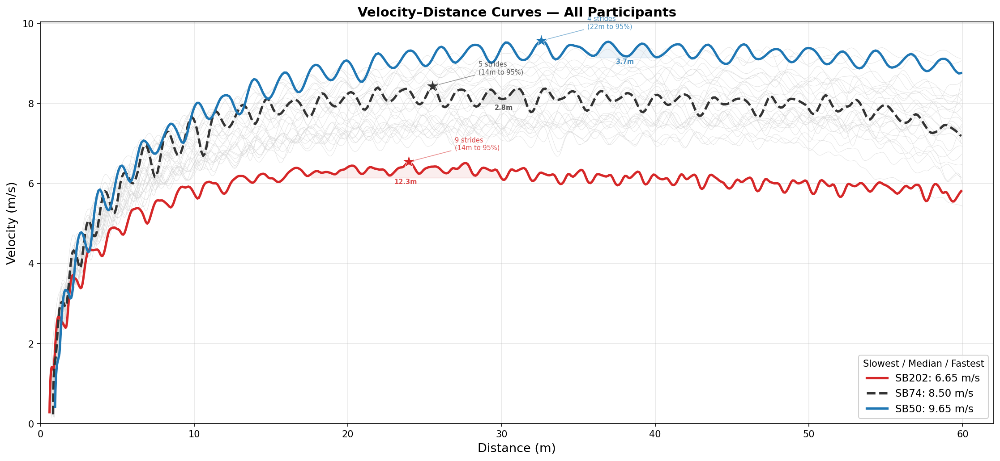
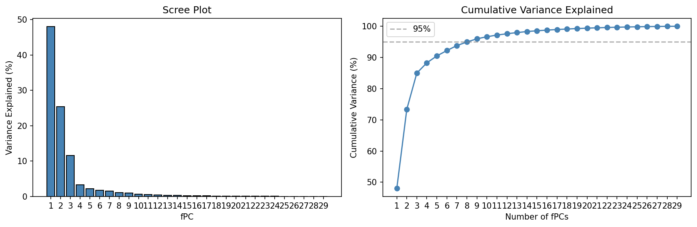
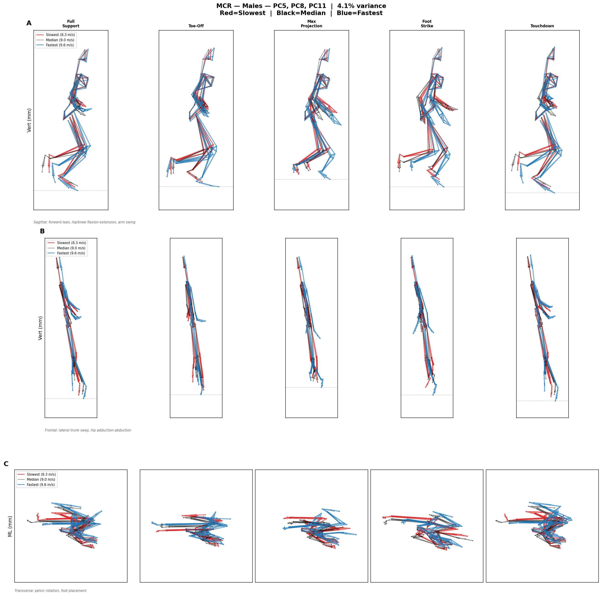
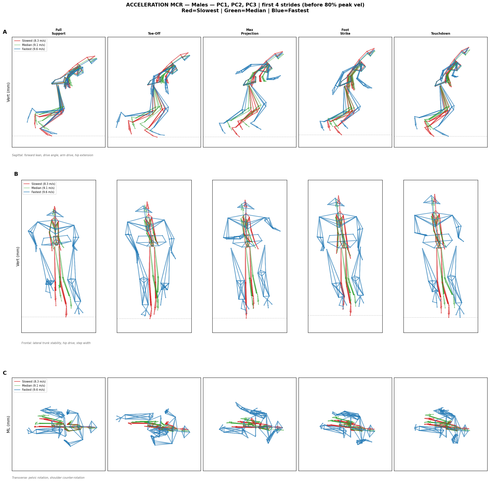
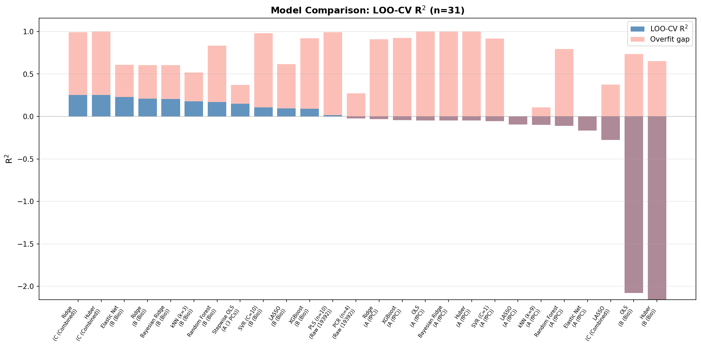
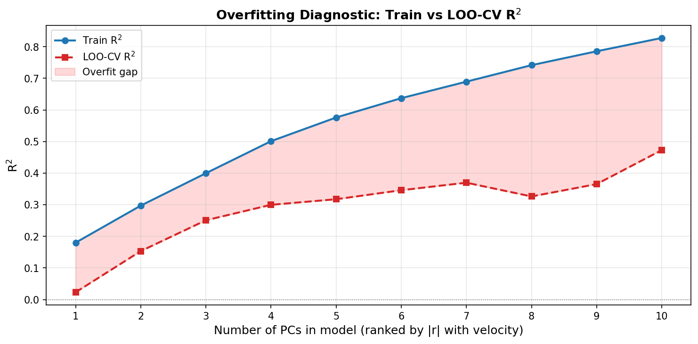
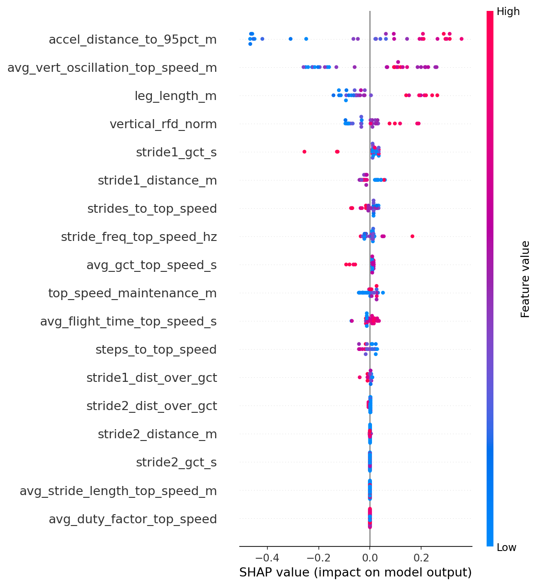
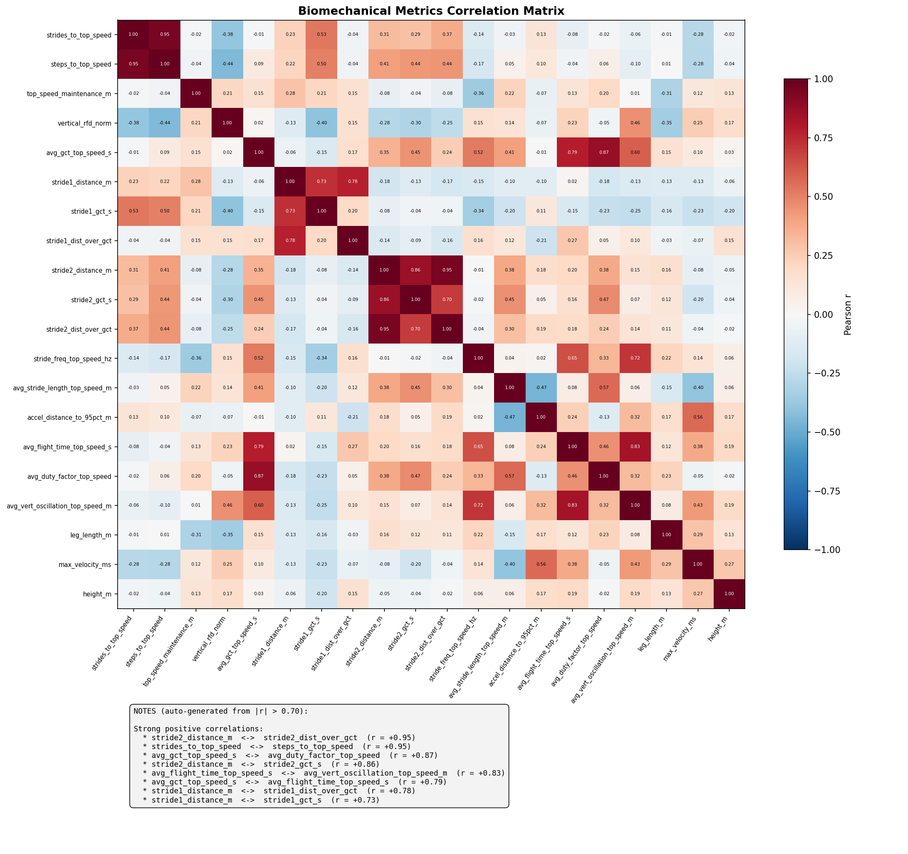
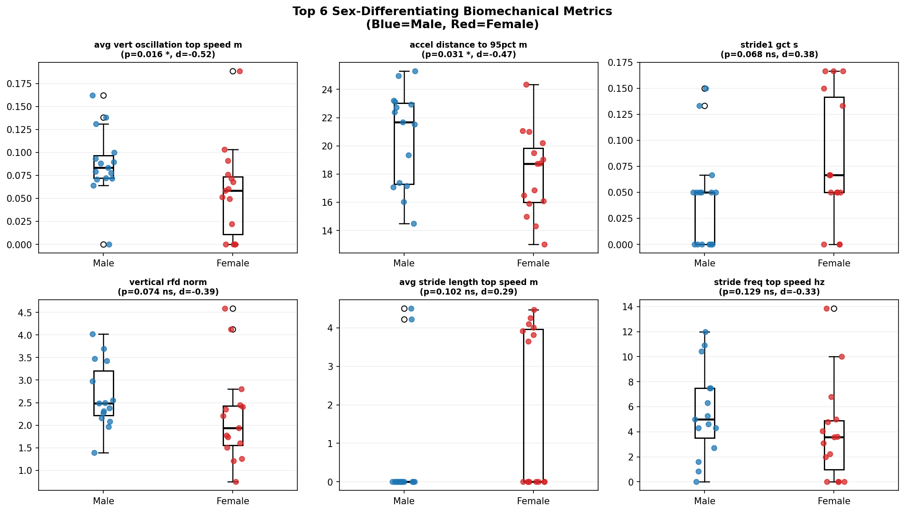

# ML in Sprinting: Predicting Sprint Speed from Whole-Body Kinematics

> *Widely regarded as the most desired physical quality in ball-sports, speed is the trait that separates elite performers from good ones — that creates plays others cannot make.*

---

## Overview

This project applies **functional Principal Component Analysis (fPCA)** and a full suite of machine learning models to whole-body kinematic data from competitive sprinters, with the goal of predicting sprint velocity and identifying movement patterns that differentiate fast from slow athletes.

Key finding: **traditional biomechanical summary statistics (n=18) outperform full fPCA (n=29 PCs) on every matched algorithm** when evaluated via LOO-CV on n=30 subjects — but fPCA provides mechanistic insight that scalars cannot.

---

## The Problem

Contemporary player-tracking systems reduce speed to single-value summaries — peak velocity, average acceleration — collapsing the temporal structure of movement into a number. This obscures a more fundamental question: **what actually constitutes speed in competitive settings?**

Shohei Ohtani's base-stealing illustrates this precisely. In 2025, his Statcast sprint speed ranked ~72nd percentile in MLB (~28.0 ft/sec), yet his stolen base efficiency exceeded 93% in 2024. His advantage lies not in raw speed, but in **how rapidly and consistently he expresses usable speed within constrained windows of time**.

Existing research examines acceleration or maximum velocity in isolation using linear models to relate discrete joint kinematics to speed. This treats sprint phases as independent phenomena rather than continuous transitions, and assumes linear relationships — even though stride frequency exhibits a logarithmic correlation by the third step (Weyand et al., 2000, 2010). No prior study has modeled sprint velocity continuously across all phases while testing for nonlinear kinematic interactions.

---

## Study Design

**30 OUA/USports-level sprinters** (15M / 15F) completed maximal-effort 60-metre sprints from blocks, instrumented with a **64-marker inertial measurement system** capturing whole-body three-dimensional kinematics at 60 Hz.

| Dimension | Detail |
|-----------|--------|
| Participants | 30 (15 Male, 15 Female) |
| Competition level | OUA / USports |
| Sprint distance | 60 metres (block start) |
| Capture rate | 60 Hz |
| Markers | 64 anatomical landmarks |
| Raw feature space | 19,392 per participant (64 markers × 3 axes × 101 frames) |

---

## Methodology

### 1 — Data Pipeline
Raw `.c3d` motion capture files are loaded per participant. Each trial undergoes:
- **Sprint start detection** — velocity threshold (1.0 m/s sustained for 5 frames)
- **PCA coordinate alignment** — GCS rotation so primary axis = travel direction
- **Origin normalisation** — posterior heel at frame 0 set to origin
- **60 m trim** — data cropped to race distance

### 2 — Stride Representation
Five strides around peak velocity are identified per participant. Each stride is:
- Time-normalised to 101 frames
- T12 vertebra-debiased (removes bulk translation)
- Height-normalised (pelvis-to-head distance)
- Averaged across strides into a single **19,392-element vector** per participant

### 3 — Functional PCA (fPCA)
PCA on the 30 × 19,392 feature matrix yields **29 principal components** (retaining >95% of variance). Each PC captures a coordinated pattern of joint motion across the full gait cycle:

| PC | Variance | Interpretation |
|----|----------|----------------|
| PC1 | 48% | Gross posture, forward lean, hip extension |
| PC5 | 2.2% | **Forward Torso Lean** — ability to maintain 45–50° forward lean through each stride |
| PC8 | 1.1% | **Hip Extension & Knee Drive Timing** — faster knee drive from swing leg, faster hip extension from stance leg |
| PC11 | 0.8% | **Directional Force Optimisation** — maximised horizontal force development, minimised vertical force |

### 4 — Biomechanical Feature Engineering (Feature Set B)
18 hand-crafted metrics extracted per participant across 6 categories:

| Category | Features | Count |
|----------|----------|-------|
| Acceleration Phase | strides/steps to top speed, distance to 95% peak, maintenance distance | 4 |
| Stride 1 | distance, GCT, efficiency ratio | 3 |
| Stride 2 | distance, GCT, efficiency ratio | 3 |
| Top Speed | stride frequency, stride length, GCT, duty factor | 4 |
| Vertical Mechanics | vertical RFD, flight time, CoM oscillation | 3 |
| Anthropometric | leg length | 1 |

### 5 — Model Comparison (26 Models × 4 Feature Sets)
All models evaluated via **Leave-One-Out Cross-Validation (LOO-CV)** — gold standard at n=30. Four feature sets compared:

| Set | Name | Features | Description |
|-----|------|----------|-------------|
| A | fPC (full) | 29 | All principal components |
| A* | fPC (3 selected) | 3 | PC5, PC8, PC11 via Stepwise OLS |
| B | Bio | 18 | Hand-crafted biomechanical metrics |
| C | Combined | 47 | A + B |
| Raw | Raw kinematics | 19,392 | Unreduced feature matrix |

**Algorithm families tested:**

| Family | Models |
|--------|--------|
| Linear (unregularised) | OLS, Stepwise OLS (Forward, BIC) |
| L2 Regularisation | Ridge, Bayesian Ridge, Huber |
| L1 / Mixed | LASSO, Elastic Net |
| Tree Ensembles | Random Forest, XGBoost |
| Kernel Methods | SVR |
| Instance-Based | kNN (k=3, k=9) |
| Dimensionality Reduction | PLS, PCR |

### 6 — Explainability
- **Ridge coefficient analysis** with 200-iteration bootstrap confidence intervals
- **LASSO coefficient path** across regularisation strengths
- **Random Forest permutation importance**
- **XGBoost SHAP values** (feature-level attribution)
- **Overfitting diagnostics** — Train R² vs LOO-CV R² as a function of PCs retained

### 7 — Kinematic Visualisation (SCR / MCR)
Single and Multi-Component Reconstruction render actual 3D skeleton postures at the 5th, 50th, and 95th percentile of each PC — directly comparing how faster and slower sprinters *look* at each phase of the gait cycle.

---

## Results

### Model Performance — LOO-CV R² (n=30)

| Rank | Model | Feature Set | R²_LOO | RMSE (m/s) | Status |
|------|-------|-------------|--------|------------|--------|
| 1 | **Ridge** | C (Combined, 47 feat) | **0.253** | 0.614 | ⭐ Best overall |
| 2 | **Huber** | C (Combined, 47 feat) | **0.253** | 0.614 | ⭐ Tied |
| 3 | **Elastic Net** | B (Bio, 18 feat) | **0.228** | 0.624 | ✅ Best bio-only |
| 4 | Ridge | B (Bio) | 0.208 | 0.632 | ✅ |
| 5 | Bayesian Ridge | B (Bio) | 0.207 | 0.633 | ✅ |
| 6 | kNN k=3 | B (Bio) | 0.178 | 0.644 | ⚠️ |
| 7 | Random Forest | B (Bio) | 0.170 | 0.647 | ⚠️ |
| 8 | **Stepwise OLS** | A* (3 PCs) | **0.149** | 0.655 | ✅ Best fPC |
| 9–13 | SVR, LASSO, XGB, PLS, PCR | B or Raw | 0.106 → -0.024 | — | ❌ Weak |
| 14–23 | Ridge, OLS, Bayesian, etc. | A (29 PCs) | **< 0 all** | — | ❌ All overfit |
| 24 | LASSO | C (47 feat) | -0.276 | 0.803 | ❌ |
| 25–26 | OLS, Huber | B (Bio) | -2.08, -2.16 | — | ❌ No regularisation |

### Key Finding: The Overfitting Paradox

**Bio features (18 scalars) outperform fPC full set (29 PCs) on every matched algorithm:**

| Algorithm | Bio R²_LOO | fPC (all 29) R²_LOO | Winner |
|-----------|-----------|---------------------|--------|
| Ridge | 0.208 | -0.031 | Bio ✅ |
| Elastic Net | **0.228** | -0.168 | Bio ✅ |
| Bayesian Ridge | 0.207 | -0.047 | Bio ✅ |
| Random Forest | 0.170 | -0.110 | Bio ✅ |
| XGBoost | 0.091 | -0.045 | Bio ✅ |

**Why:** n=30 × 29 PCs is a near-saturated model space. LOO-CV exposes overfitting that train R² conceals (train R² ≈ 1.0 for all fPC models). Bio features (18 dims) have a better sample-to-feature ratio.

### Feature Importance — Top 5 Bio Predictors

| Rank | Feature | Category | Importance | Direction |
|------|---------|----------|-----------|-----------|
| 1 | avg_vert_oscillation_top_speed_m | Vertical | ⭐⭐⭐⭐⭐ | Lower = faster |
| 2 | accel_distance_to_95pct_m | Acceleration | ⭐⭐⭐⭐ | Shorter = faster |
| 3 | stride1_gct_s | Stride 1 | ⭐⭐⭐ | Shorter = faster |
| 4 | avg_stride_length_top_speed_m | Top Speed | ⭐⭐⭐ | Longer = faster |
| 5 | avg_gct_top_speed_s | Top Speed | ⭐⭐⭐ | Shorter = faster |

### Scree & PC Interpretation

- LOO-CV R² peaks at **6 PCs** (R² ≈ 0.32) then collapses as more PCs added
- Full 29-PC set: R²_LOO < 0 on every algorithm
- **PC8** (1.1% of variance) = **#2 strongest predictor** after avg_vert_oscillation
  - Movement pattern: hip extension & knee drive timing — faster knee drive from swing leg, faster hip extension from stance leg
  - Subtle ≠ unimportant; timing coordination matters more than variance explained

---

## Figures

### Velocity–Distance Profiles
All 30 participants. Stars mark peak velocity; shaded zones show top-speed maintenance windows.



---

### Scree Plot — Variance Explained by PC


---

### Multi-Component Reconstruction — Top Speed Phase (PC5 + PC8 + PC11, Males)
Combined effect of the three selected PCs at 5 gait-cycle positions during top-speed running. Captures forward torso lean, hip extension/knee drive timing, and directional force optimisation.



---

### Multi-Component Reconstruction — Acceleration Phase (PC1–PC4, Males, First 4 Strides)
PC1–PC4 reconstruction across the first 4 strides of block acceleration. Shows how gross postural patterns evolve from block clearance into upright sprinting.



---

### Model Comparison — LOO-CV R²
All 26 model × feature-set combinations ranked by out-of-sample performance.



---

### Overfitting Diagnostic
Train R² (blue) vs LOO-CV R² (red) as principal components are added sequentially.



---

### SHAP Feature Importance (XGBoost)
Which biomechanical metrics drive velocity predictions — and in which direction.



---

### Biomechanics Correlation Matrix
Pairwise correlations among all 18 biomechanical features.



---

### Sex Differences
Sprint velocity and kinematic profiles split by sex (15M / 15F).



---

## Repository Structure

```
ML-Biomechanics-Comprehensive-Analysis-of-the-60m-Sprint/
├── sprint_fPCA_pipeline.ipynb       ← Single executable notebook
├── bio_features_panelA.png          ← All 18 bio features overview
├── bio_features_panelB.png          ← Model comparison bar chart
├── bio_features_panelCD.png         ← Bio vs fPC head-to-head
└── outputs/
    ├── data/
    │   ├── metadata.csv                        (participant ID, sex, velocity, height)
    │   ├── sprint_biomechanics_metrics.csv     (18 biomechanical metrics × 30 participants)
    │   ├── model_comparison.csv                (LOO-CV results, all 26 models)
    │   ├── split_times.csv                     (radar-measured split times)
    │   ├── sex_differences.csv                 (M/F comparison)
    │   └── cross_phase_comparison.csv          (acceleration vs top-speed phase)
    └── figures/                                (40+ publication-ready PNGs)
        ├── SCR_PC{5,7,8,10,19,21}.png          (single component reconstructions)
        ├── MCR_figure6.png                     (multi-component reconstruction)
        ├── model_comparison.png
        ├── overfitting_diagnostics.png
        ├── scree_plot.png
        ├── shap_summary.png
        ├── feature_importance.png
        └── ...
```

---

## Reproduction

```bash
# 1. Install dependencies
pip install numpy pandas scikit-learn scipy matplotlib tqdm statsmodels xgboost lightgbm shap ezc3d

# 2. Place .c3d motion capture files in:
#    ../60m Data/All Sprint Trials/

# 3. Open notebook
jupyter notebook sprint_fPCA_pipeline.ipynb
# Kernel → Restart & Run All
# Runtime: ~5–10 minutes
```

> **Note:** Raw `.c3d` files and `.xlsx` data are not included in this repository (participant privacy). Contact the author for data access.

---

## References

Beaudette, S. M., Zwambag, D. P., Graham, R. B., & Brown, S. H. M. (2019). Discriminating spatiotemporal movement strategies during spine flexion-extension in healthy individuals. *The Spine Journal*, 19(7), 1264–1275. https://doi.org/10.1016/j.spinee.2019.02.002

Bholowalia, P., & Kumar, A. (2014). EBK-Means: A Clustering Technique based on Elbow Method and K-Means in WSN. *International Journal of Computer Applications*, 105(9), 17–24.

Braunstein, B., Goldmann, J.-P., Albracht, K., Sanno, M., Willwacher, S., Heinrich, K., Herrmann, V., & Brüggemann, G.-P. (2013). Joint specific contribution of mechanical power and work during acceleration and top speed in elite sprinters. *ISBS — Conference Proceedings Archive*.

Brazil, A., Exell, T., Wilson, C., Willwacher, S., Bezodis, I., & Irwin, G. (2017). Lower limb joint kinetics in the starting blocks and first stance in athletic sprinting. *Journal of Sports Sciences*, 35(16), 1629–1635. https://doi.org/10.1080/02640414.2016.1227465

Brazil, A., Exell, T., Wilson, C., Willwacher, S., Bezodis, I. N., & Irwin, G. (2018). Joint kinetic determinants of starting block performance in athletic sprinting. *Journal of Sports Sciences*, 36(14), 1656–1662. https://doi.org/10.1080/02640414.2017.1409608

Čoh, M., Hébert-Losier, K., Štuhec, S., Babić, V., & Supej, M. (2018). Kinematics of Usain Bolt's maximal sprint velocity. *Kinesiology*, 50(2), 172–180. https://doi.org/10.26582/k.50.2.10

Colyer, S. L., Nagahara, R., Takai, Y., & Salo, A. I. T. (2018). How sprinters accelerate beyond the velocity plateau of soccer players: Waveform analysis of ground reaction forces. *Scandinavian Journal of Medicine & Science in Sports*, 28(12), 2527–2535. https://doi.org/10.1111/sms.13302

Daley, M. A., & Biewener, A. A. (2006). Running over rough terrain reveals limb control for intrinsic stability. *Proceedings of the National Academy of Sciences*, 103(42), 15681–15686. https://doi.org/10.1073/pnas.0601473103

Debaere, S., Delecluse, C., Aerenhouts, D., Hagman, F., & Jonkers, I. (2013). From block clearance to sprint running: Characteristics underlying an effective transition. *Journal of Sports Sciences*, 31(2), 137–149. https://doi.org/10.1080/02640414.2012.722225

Debaere, S., Delecluse, C., Aerenhouts, D., Hagman, F., & Jonkers, I. (2015). Control of propulsion and body lift during the first two stances of sprint running: A simulation study. *Journal of Sports Sciences*, 33(19), 2016–2024. https://doi.org/10.1080/02640414.2015.1026375

Dhawale, N., & Venkadesan, M. (2023). How human runners regulate footsteps on uneven terrain. *eLife*, 12, e67177. https://doi.org/10.7554/eLife.67177

Diker, G., Müniroğlu, S., Ön, S., Özkamçı, H., & Darendeli, A. (2021). The relationship between sprint performance and both lower and upper extremity explosive strength in young soccer players. *Pedagogy of Physical Culture and Sports*, 25(1). https://doi.org/10.15561/26649837.2021.0102

Geyer, H., Seyfarth, A., & Blickhan, R. (2006). Compliant leg behaviour explains basic dynamics of walking and running. *Proceedings of the Royal Society B*, 273(1603), 2861–2867. https://doi.org/10.1098/rspb.2006.3637

Higashihara, A., Nagano, Y., Ono, T., & Fukubayashi, T. (2018). Differences in hamstring activation characteristics between the acceleration and maximum-speed phases of sprinting. *Journal of Sports Sciences*, 36(12), 1313–1318. https://doi.org/10.1080/02640414.2017.1375548

Hsiao, H., Knarr, B. A., Higginson, J. S., & Binder-Macleod, S. A. (2015). The relative contribution of ankle moment and trailing limb angle to propulsive force during gait. *Human Movement Science*, 39, 212–221. https://doi.org/10.1016/j.humov.2014.11.008

Kariyama, Y., & Zushi, K. (2016). Relationships between lower-limb joint kinetic parameters of sprint running and rebound jump during the support phases. *The Journal of Physical Fitness and Sports Medicine*, 5(2), 187–193. https://doi.org/10.7600/jpfsm.5.187

McKenna, M., & Riches, P. E. (2007). A comparison of sprinting kinematics on two types of treadmill and over-ground. *Scandinavian Journal of Medicine & Science in Sports*, 17(6), 649–655. https://doi.org/10.1111/j.1600-0838.2006.00625.x

Morin, J.-B., Bourdin, M., Edouard, P., Peyrot, N., Samozino, P., & Lacour, J.-R. (2012). Mechanical determinants of 100-m sprint running performance. *European Journal of Applied Physiology*, 112(11), 3921–3930. https://doi.org/10.1007/s00421-012-2379-8

Morin, J.-B., Edouard, P., & Samozino, P. (2011). Technical ability of force application as a determinant factor of sprint performance. *Medicine and Science in Sports and Exercise*, 43(9), 1680–1688. https://doi.org/10.1249/MSS.0b013e318216ea37

Rabita, G., Dorel, S., Slawinski, J., Sàez-de-Villarreal, E., Couturier, A., Samozino, P., & Morin, J.-B. (2015). Sprint mechanics in world-class athletes: A new insight into the limits of human locomotion. *Scandinavian Journal of Medicine & Science in Sports*, 25(5), 583–594. https://doi.org/10.1111/sms.12389

Sado, N., Yoshioka, S., & Fukashiro, S. (2020). Three-dimensional kinetic function of the lumbo-pelvic-hip complex during block start. *PloS One*, 15(3), e0230145. https://doi.org/10.1371/journal.pone.0230145

Schache, A. G., Blanch, P. D., Dorn, T. W., Brown, N. A. T., Rosemond, D., & Pandy, M. G. (2011). Effect of running speed on lower limb joint kinetics. *Medicine and Science in Sports and Exercise*, 43(7), 1260–1271. https://doi.org/10.1249/MSS.0b013e3182084929

Seethapathi, N., & Srinivasan, M. (2019). Step-to-step variations in human running reveal how humans run without falling. *eLife*, 8, e38371. https://doi.org/10.7554/eLife.38371

Slawinski, J., Bonnefoy, A., Levêque, J.-M., Ontanon, G., Riquet, A., Dumas, R., & Chèze, L. (2010). Kinematic and kinetic comparisons of elite and well-trained sprinters during sprint start. *Journal of Strength and Conditioning Research*, 24(4), 896–905. https://doi.org/10.1519/JSC.0b013e3181ad3448

Valamatos, M. J., Abrantes, J. M., Carnide, F., Valamatos, M.-J., & Monteiro, C. P. (2022). Biomechanical performance factors in the track and field sprint start: A systematic review. *International Journal of Environmental Research and Public Health*, 19(7), 4074. https://doi.org/10.3390/ijerph19074074

Vellucci, C. L., & Beaudette, S. M. (2022). A need for speed: Objectively identifying full-body kinematic and neuromuscular features associated with faster sprint velocities. *Frontiers in Sports and Active Living*, 4, 1094163. https://doi.org/10.3389/fspor.2022.1094163

von Lieres Und Wilkau, H. C., Irwin, G., Bezodis, N. E., Simpson, S., & Bezodis, I. N. (2020). Phase analysis in maximal sprinting: An investigation of step-to-step technical changes between the initial acceleration, transition and maximal velocity phases. *Sports Biomechanics*, 19(2), 141–156. https://doi.org/10.1080/14763141.2018.1473479

Werkhausen, A., Willwacher, S., & Albracht, K. (2021). Medial gastrocnemius muscle fascicles shorten throughout stance during sprint acceleration. *Scandinavian Journal of Medicine & Science in Sports*, 31(7), 1471–1480. https://doi.org/10.1111/sms.13956

Weyand, P. G., Sandell, R. F., Prime, D. N. L., & Bundle, M. W. (2010). The biological limits to running speed are imposed from the ground up. *Journal of Applied Physiology*, 108(4), 950–961. https://doi.org/10.1152/japplphysiol.00947.2009

Yada, K., Ae, M., Tanigawa, S., Ito, A., Fukuda, K., & Kijima, K. (2011). Standard motion of sprint running for male elite and student sprinters. *ISBS — Conference Proceedings Archive*.

---

*Analysis pipeline: Python 3.13 · scikit-learn 1.6 · XGBoost 3.0 · SHAP 0.50 · ezc3d*
