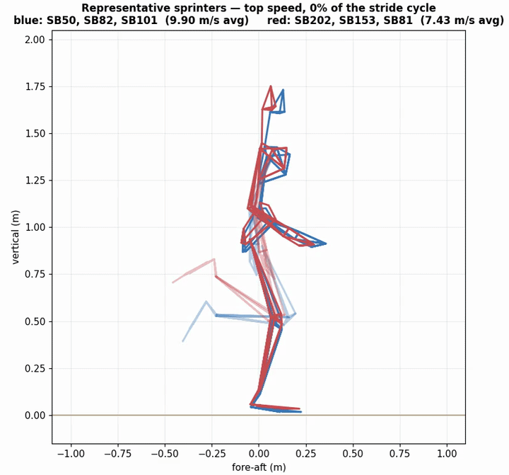
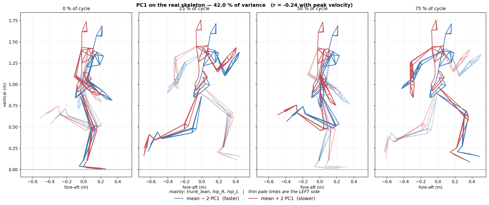
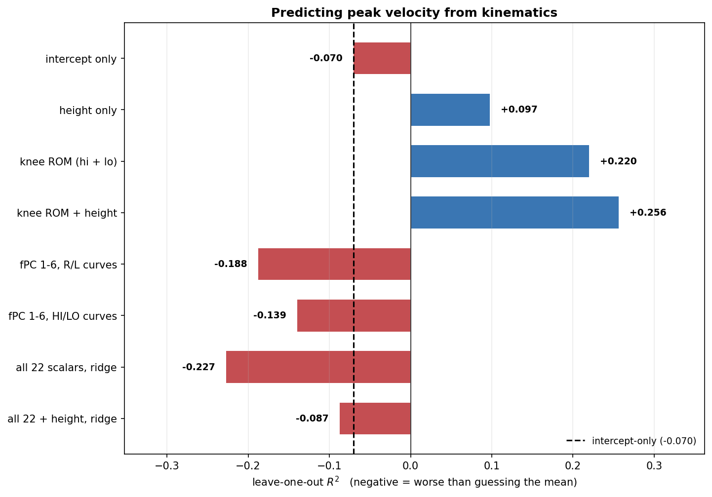
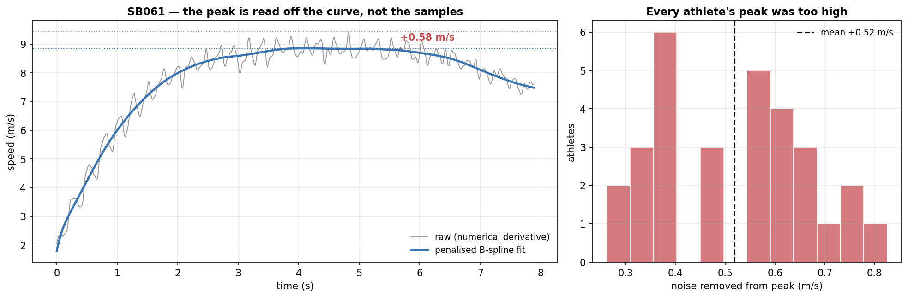
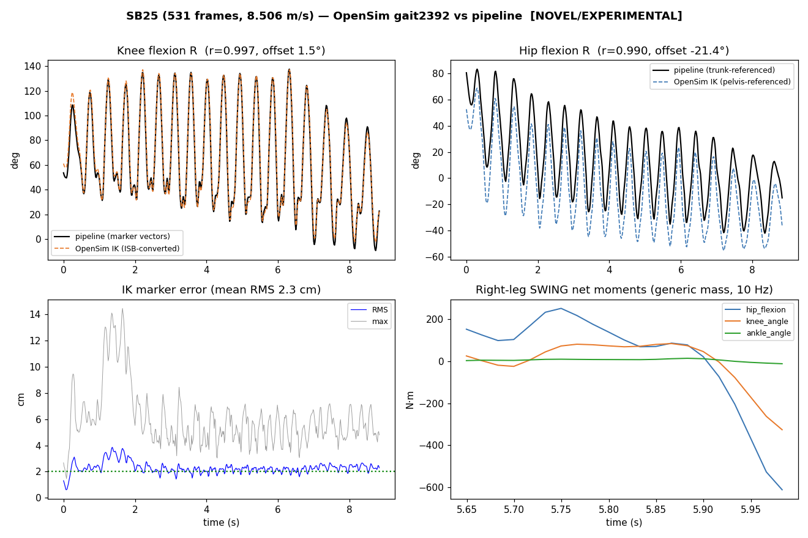

# 60 m sprint pipeline



*Mean-cycle skeleton overlay of the three faster vs three slower athletes (blue = faster). [Source MP4](animations/representative_top3_vs_bottom3.mp4)*

30 athletes · Xsens 64 virtual landmarks · 60 Hz · `/opt/anaconda3/bin/python`

**How this repo moves:** read this file first. Keep what is marked **keep**. Next code commit implements **next iteration** only. Recompute every number from data (`04` / `05` / `07`). Invariant: trial **SB25 = 531 frames, 8.506 m/s**. Permutations = **5,000**. Do not invent body mass. Blue = faster. Knee = ISB (flexion positive).

Google XYZ below: *accomplished **X** as measured by **Y** by doing **Z***.

---

## What it looks like

<table>
<tr>
<td>
<a href="figures/Block%20Start/block_exit_SB80.png"></a>
<br><sub>SB80 stick figures from set through block exit and the first three steps.</sub>
</td>
<td>
<a href="figures/pc1_anatomy.png"></a>
<br><sub>Angle fPCA PC1 drawn on the skeleton at four points in the stride cycle (blue = faster; 1.75 m scale is drawing only).</sub>
</td>
</tr>
<tr>
<td>
<a href="figures/model_comparison_loocv.png"></a>
<br><sub>Leave-one-out R² for kinematic models of peak velocity; the audited headline remains knee ROM + height.</sub>
</td>
<td>
<a href="figures/velocity_bspline_fit.png"></a>
<br><sub>Pelvis AP speed with a penalised B-spline so peak velocity is read from the curve, not the noisy derivative.</sub>
</td>
</tr>
<tr>
<td>
<a href="opensim/out/SB25_summary.png"></a>
<br><sub>SB25 OpenSim gait2392 IK against the pipeline (experimental, isolated). IK is the mass-free deliverable; ID moments use generic mass.</sub>
</td>
<td></td>
</tr>
</table>


## Keep (do not regress)

- Honest LOO + nested selection; do not wire new features into audited `build_feature_table` `X`.
- Mass-free mechanics: `a0`, `V0`, `τ`, `RFmax`, `DRF`. Never fill `F0`/`Pmax` with a dummy kg.
- `RFmax` is a 1–1 function of `a0` (r ≈ +0.995) — not a second finding.
- 1.75 m height scale is **drawing only** (animations / fPCA skeletons). Analysis uses measured stature, unscaled velocity.
- OpenSim stays isolated (`06`, `sprint_opensim.py`, `opensim/`). IK is the mass-free deliverable; ID N·m are generic-mass shapes.
- Library: `sprint_pipeline.py` functions only, no import-time side effects. Do not edit `sprint_helpers.py`. No new deps.

---

## Next iteration (the next commit after this README)

Priority order. Each item: keep the good above.

- [x] **Make paths portable and explain the project big-picture-first.** `project_paths.py` now derives the project root, supports environment overrides, and all current modules/notebooks import it. `00_Project_Overview.ipynb` is the reader entry point. Raw data was not moved.
- [ ] **Stop averaging acceleration onto a cycle.** `build_feature_table` still feeds alternate-foot first steps into `stride_cycle_angles`. Treat steps as a *process* (Section 12 / notebook 07). Same-foot windows only if you still need a cycle.
- [ ] **Do not over-claim `a0` as technique.** It summarises the pelvis v(t) *rise*, so it sits closer to peak speed than a joint angle. Next: step-level spatiotemporal / touchdown geometry (still mass-free), pre-specified, nested or univariate + 5,000 shuffles, control for contact-time window length.
- [ ] **Coordination (vector coding / CRP)** on existing 101-point cycles — the manuscript’s arm–leg story, measured. Pre-specify pairs. Isolated from audited `X`.
- [ ] **fPCA without per-angle unit-variance** (`standardize=False` in fold-refit `fpca_fold_transform`) so PC1 is not handed to trunk lean. Default `True` to protect 01/04 numbers.
- [ ] **OpenSim:** batch IK (angles only) if needed; do not report stance ID or athlete-specific moments without measured mass.
- [ ] **Leave for later:** mixed-effects on ≤5 top-speed strides/athlete; mass-free spring stiffness `k/m`; PyMC (new dep — external only).

---

## Notebooks

### `00_Project_Overview.ipynb` — start here

- **What:** Big-picture research questions, current takeaways, evidence hierarchy, and reading order.
- **Why:** Lets a new reader understand the project before opening implementation details.
- **How:** Reads `PATHS`; performs no modelling and writes no outputs.
- **XYZ:** Reduced entry-point ambiguity as measured by one ordered map from sprint regimes to validation and provenance by separating overview from analysis.

### `sprint_pipeline.ipynb` — preprocess QA

- **What:** Stage-by-stage check from C3D → aligned markers → strides → angles.
- **Why:** Catch unit, axis, and contact bugs before modelling.
- **How:** Run each stage; inspect tables. Not a results paper.
- **XYZ:** Caught merged-stride and axis errors as measured by rejected windows / phase-spread guards by printing every stage before fPCA.

### `01_Angle_fPCA.ipynb` — how athletes differ (unsupervised)

- **What:** fPCA on 13 sagittal angle cycles (not marker positions).
- **Why:** Position-PCA made PC1 body size (96.5% variance, r = +0.24 with speed). Angles are size-free.
- **How:** Time-normalise strides to 101 points; fPCA; optional 1.75 m scale **for drawing only**.
- **XYZ:** Stopped PC1 measuring stature as measured by moving from position-PC1 96.5% / r=+0.24 to angle-PC1 that is mostly trunk-lean variance (weakly related to speed) by running fPCA on joint angles.
- **Keep / change:** Keep angles not positions. **Change:** covariance fPCA without per-angle standardisation (next iteration #4). Do not use 01 as a speed model.

### `02_Animations.ipynb` — render only

- **What:** Writes MP4s via `sprint_outputs.py`.
- **Why:** See the movement 01 describes.
- **How:** No modelling. Height scale for overlay only.
- **XYZ:** Made components inspectable as measured by MP4s in `mp4s/` by rendering mean cycles without touching the models.

### `03_Kinematics_ML.ipynb` — can kinematics predict speed?

- **What:** LOO models from scalar kinematics to peak velocity.
- **Why:** In-sample fit on n=30 lies.
- **How:** `model_ladder`, `nested_cv`, 5,000 shuffles. Honest headline in the ledger: **knee ROM + height, LOO R² = +0.256**.
- **XYZ:** Cut a 1,540-model search from reported R² +0.40 to honest **−0.02** by repeating selection inside each LOO fold.
- **Keep / change:** Keep LOO + permutation. Prefer **05** as the citation source if 03 and 05 disagree. **Change:** do not add `a0` into this notebook’s audited story without a new isolated section.

### `04_Audit_Provenance.ipynb` — source of truth for *old* documented figures

- **What:** One labelled cell per audit-document number.
- **Why:** Numbers must be recomputed, not copied.
- **How:** Run the named cell.
- **XYZ:** Made every audit claim checkable as measured by a cell that reprints the figure by tying each claim to code.
- **Keep:** SB25 531 / 8.506. If you change loaders, say which 04 cells break.

### `05_Validation_Ledger.ipynb` — what survives honest tests

- **What:** Leakage ledger, SPM (knee/hip/trunk), ICC vs extra strides, knee sampling vs definition offset.
- **Why:** Published R² 0.80–0.92 is mostly selection leakage.
- **How:** Nested LOO; SPM cluster permutation 5,000; spline peak-gap vs speed.
- **XYZ:** Showed the field’s accuracy is inflated as measured by exhaustive-search R² +0.403 → nested **−0.020**, and localised speed-related knee/hip effects to **swing**, by putting every shortcut’s cost next to the cell that measured it.
- **Keep:** Ledger structure; 5,000 shuffles; do not treat stance ROM as a finding (window-length confound).

### `06_OpenSim_Musculoskeletal.ipynb` — **experimental, isolated**

- **What:** SB25 `C3D → TRC → Scale → IK → swing ID` via `opensim-cmd` (no Python `opensim` in conda).
- **Why:** Test whether the ~16° knee vs video gap is pipeline-vs-OpenSim; get ISB-like 3-D angles.
- **How:** gait2392 + Xsens virtual landmarks; Z-up → Y-up `(X,Z,−Y)`; documented knee sign conversion (gait2392 negative-in-flexion).
- **XYZ:** Showed the ~16° literature knee gap is **not** pipeline vs OpenSim as measured by knee r≈0.99 and ~1.5° offset after the known sign conversion, by IK on SB25. The real definition offset is **hip ~21°** (trunk vs pelvis).
- **Keep:** Isolation; mass-free IK. **Change:** do not treat ID N·m as athlete kinetics; optional cohort IK later.

### `07_Acceleration_Process.ipynb` — **isolated, mass-free**

- **What:** First-8-step spatiotemporal + mono-exponential v(t); Samozino quantities that do not need mass.
- **Why:** Acceleration is a transient, not a cycle to average. No weights in the study.
- **How:** Section 12; `build_accel_feature_table` (does **not** mutate audited `X`); pre-specified tests + 5,000 shuffles; LOO vs knee+height.
- **XYZ:** Described the velocity rise without kilograms as measured by mass-free **a0 LOO R² = +0.356** (p=0.0004) vs audited knee+height **+0.256**, and **a0+height +0.405** (p=0.0002), by fitting `v(t)=v_max(1−e^{−t/τ})` to pelvis AP speed. Knee ROM does not add on top of a0+height.
- **Keep:** Mass-free; a0 not RFmax as a second model. **Change:** next features = step geometry, not dummy mass; do not sell a0 as a joint-level coaching cue.

---

## Library (`sprint_pipeline.py`)

| Section | What | Why / How |
|---|---|---|
| 1–3 Load / clean | C3D → metres, SVD travel axis, trim 62 m | Removes units, lane drift, standing around |
| 4 Strides | Top-speed same-foot; first steps alternate-foot | Top speed is cyclic; accel legs do different jobs |
| 5 Angles | 13 sagittal, ISB | Size-free; do not silent-flip signs |
| 6–8 fPCA / scalars | B-spline smooth, HI/LO recode, ROM/means | Variance ≠ prediction; HI/LO avoids smearing sides |
| 9 Features | `build_feature_table` → audited `X`, `y` | One row/athlete; velocity unscaled |
| 10 Models | LOO, nested CV, 5,000 perm | Honest small-n |
| 11 SPM | Pointwise r + cluster perm | *Where* in the cycle |
| 12 Accel process | Contacts, pelvis v(t), mass-free FVP | Isolated table; no dummy mass |

`sprint_opensim.py`: TRC/Scale/IK/ID wrappers. `sprint_outputs.py`: figures/MP4s. **Do not edit `sprint_helpers.py`.**

### Portable paths (`project_paths.py`)

- Derives `Pipeline/` and the project root from `project_paths.py`; moving the whole project does not require editing source. `Pipeline/` sits at the project root alongside the numbered folders; the project root is the nearest ancestor containing `(2) Data (C,P,A)`.
- Prefers data under `(2) Data (C,P,A)/31 Trials Data Folder`. A symlink at the old root name `31 Trials Data Folder` remains so leftover scripts still resolve.
- Resolves `(1) Research Resources` and `(3) Manuscripts, Presentations` directly.
- Override locations without editing code:

```bash
export SPRINT_PROJECT_ROOT="/path/to/60m Project Folder"
export SPRINT_DATA_ROOT="/path/to/data"
export SPRINT_C3D_DIR="/path/to/c3d"
export SPRINT_ANTHRO_PATH="/path/to/anthropometrics.xlsx"
export SPRINT_MANUSCRIPT_DIR="/path/to/manuscripts"
export SPRINT_OPENSIM_CMD="/path/to/opensim-cmd"
```

All current notebooks import `PATHS` in their first executable cell. Notebook 05 writes through `PATHS.results`, not the kernel working directory.

---

## Other tracked artefacts

- `media/` — README hero GIF (source MP4 stays under `animations/`).
- `results/*.csv` — ledger exports from 05.
- `SSAC27_Abstract.md` — Sloan draft; numbers must match 05 after any upstream change.
- `opensim/` — SB25 experiment files (not `_extract/` tutorials).
- `(3) Manuscripts, Presentations/Abstracts, Manuscripts/60m_Sprint_Kinematics_Leakage_Ledger_Manuscript.md` — current big-picture-to-detail write-up; legacy claims are explicitly retained, corrected, or retired.
- `LEGACY_ANALYSIS_MAP.md` — file-by-file crosswalk from the old notebooks/scripts to the current evidence hierarchy.
- `(4) Archive/Shun's Sprints Code` and `(4) Archive/Old Outputs` — historical archive (symlinks remain at the old root names). Use for qualitative context; do not cite old ML scores over 05/07.

---

## Run

```bash
/opt/anaconda3/bin/python -c "import sprint_pipeline; print('ok')"
```

C3D / `clean_for_angles` / `opensim-cmd` need an unsandboxed process (numpy SVD SIGBUS in the sandbox). OpenSim: `/Applications/OpenSim 4.5/bin/opensim-cmd`.
